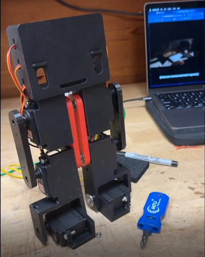
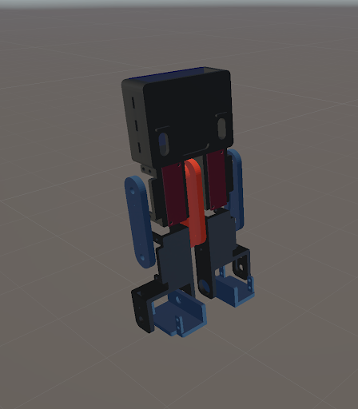
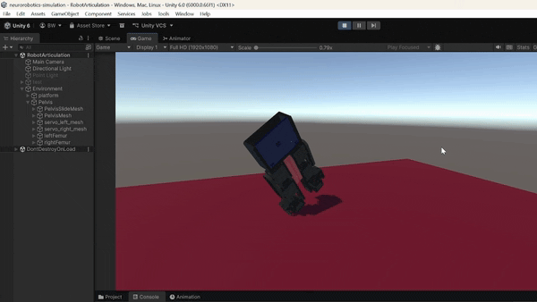
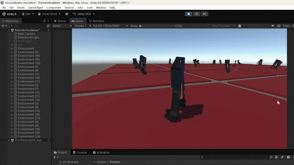
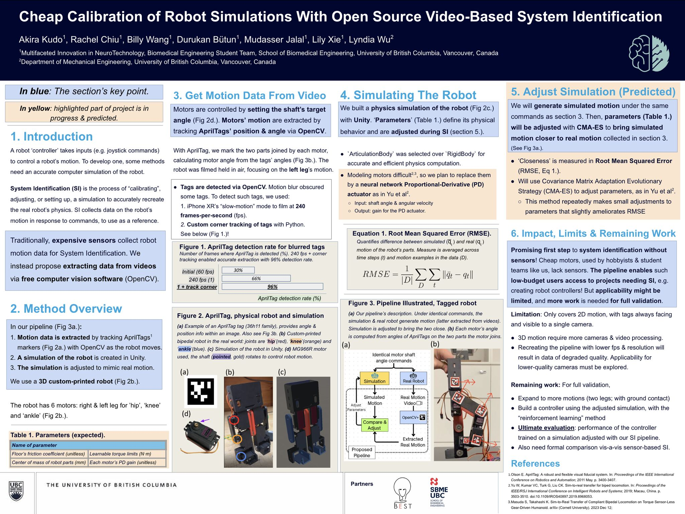

# Neurorobotics Simulation

**UBC MINT (Medical Innovation and Technology) — Neurorobotics Division**

A Unity-based reinforcement learning simulation environment for training a custom-built bipedal robot to balance and walk. The robot is physically constructed from 3D-printed parts and controlled via servo motors; this simulation serves as the training ground before deploying learned policies to hardware.

Built with [Unity ML-Agents](https://github.com/Unity-Technologies/ml-agents) and trained using Proximal Policy Optimization (PPO).

---

## Demo

### Robot Appearance

<table>
  <tr>
    <td></td>
    <td></td>
  </tr>
  <tr>
    <td align="center">Physical Robot</td>
    <td align="center">Unity Simulation</td>
  </tr>
</table>

### Training Process


---

## Presentations

### MURC 2026 — Multidisciplinary Undergraduate Research Conference


```
Presented at MURC 2026, University of British Columbia.
```

---

## Features

- **Two RL agents**: a balance agent (`MintRobotBalance`) and a walk-to-goal agent (`Neurorobotics`)
- **Domain randomization**: joint stiffness, damping, and floor friction are sampled each episode to improve sim-to-real transfer
- **Parallel training**: multiple environment instances run simultaneously to accelerate training
- **Keyboard heuristic control**: manually drive robot joints for debugging before a model is trained
- **Physical robot integration**: Unity scenes built from real 3D-printed FBX part files (pelvis, femur, tibia, servo motors)

---

## Project Structure

```
neurorobotics-simulation/
├── Assets/
│   ├── Scripts/
│   │   ├── BlackRobot/         # Balance agent (RobotAgent, ArticulationLimb, RobotMovement)
│   │   ├── MlAgents/           # Walk-to-goal agent (WalkerAgent) and helper components
│   │   ├── CameraController.cs
│   │   └── KeyboardControl.cs
│   ├── Parts/                  # 3D-printed robot part FBX files
│   ├── Prefabs/                # Environment and robot prefabs
│   └── Scenes/                 # Unity scenes
├── config/
│   ├── robotBalance.yaml       # PPO config for balance training
│   └── GoToGoal.yaml           # PPO config for walk-to-goal training
└── results/                    # Saved model checkpoints and training logs
```

---

## Getting Started

### Prerequisites

- [Unity 2022.3 LTS](https://unity.com/releases/editor/archive) or newer
- Python 3.9–3.10
- ML-Agents Python package

```bash
pip install mlagents==1.1.0
```

### Setup

1. Clone the repository:

```bash
git clone https://github.com/UBCMint/neurorobotics-simulation.git
```

2. Open the project in Unity Hub by pointing it to the cloned folder.
3. Open the desired scene from `Assets/Scenes/`.

---

## Training

### Balance Agent

Trains the robot to stand upright. Uses domain randomization over joint stiffness, damping, and floor friction.

```bash
mlagents-learn config/robotBalance.yaml --run-id=balance_run_1
```

| Parameter | Value |
|---|---|
| Trainer | PPO |
| Max Steps | 5,000,000 |
| Batch Size | 1024 |
| Hidden Units | 128 × 2 layers |

### Walk-to-Goal Agent

Trains the robot to walk toward a moving target at a target speed.

```bash
mlagents-learn config/GoToGoal.yaml --run-id=goal_run_1
```

| Parameter | Value |
|---|---|
| Trainer | PPO |
| Max Steps | 30,000,000 |
| Batch Size | 2048 |
| Hidden Units | 256 × 3 layers |

### Monitoring Training

```bash
tensorboard --logdir results/
```

Checkpoints are saved to `results/<run-id>/` during training.

---

## Controls

For manual testing and debugging before a trained model is available.

### Camera (`CameraController.cs`)

| Key / Input | Action |
|---|---|
| W / A / S / D | Move horizontally |
| E | Move up |
| Q | Move down |
| Right-click + Mouse | Look around |

### Balance Agent Heuristic (`RobotAgent.cs`)

Used to manually drive the balance agent during development.

| Key | Limb | Action |
|---|---|---|
| W / S | Left Femur | Forward / Backward |
| I / K | Right Femur | Forward / Backward |
| D / A | Left Tibia | Forward / Backward |
| L / J | Right Tibia | Forward / Backward |
| E / Q | Left Foot | Forward / Backward |
| O / U | Right Foot | Forward / Backward |

### Single Joint Debug (`SingleJointKeyboardDriver.cs`)

Attach to any body part in the Inspector to test individual joints.

| Key | Action |
|---|---|
| C | Increase joint angle |
| V | Decrease joint angle |
| Z | Increase joint strength |
| X | Decrease joint strength |

---

## Contributing

This project is actively developed by the UBC MINT Neurorobotics team.

1. Branch off `main` using a descriptive name (e.g., `feature/reward-shaping`)
2. Open a pull request with a summary of your changes
3. Request a review from a team member before merging

---

*UBC MINT Neurorobotics — University of British Columbia*
